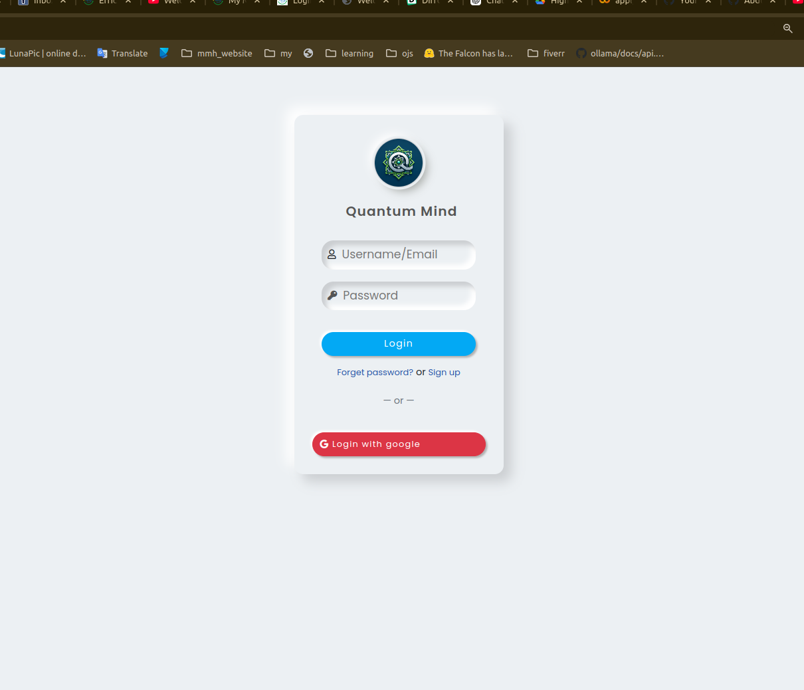

# QuantumMind

<div align="center">
  
</div>

## Table of Contents
1. [Project Structure](#project-structure)
2. [Tech Stack](#tech-stack)
3. [Setup and Installation](#setup-and-installation)


### Project Structure
```plaintext
.
├── accounts                    # User authentication and profile management
├── core                        # Business logic and utilities
│   ├── data
│   ├── di
│   ├── domain
│   │   └── models                  
├── docker-compose.yaml         # Docker Compose configuration
├── Dockerfile                  # Dockerfile for the Django app
├── example.env                 # Example environment variables
├── manage.py                   # Django management script
├── app_[0-n]                   # Django apps for different features
├── project                     # Django project settings
├── public                      # Static files and templates
├── pyproject.toml              # Poetry configuration
├── README.md                   # Project README
└── services                    # AI services and utilities used by the apps
```

### Tech Stack
- **Framework**: Django
- **Database**: PostgreSQL
- **Authentication**: Django REST Framework
- **Frontend**: Vanilla JavaScript, HTML, CSS [will be replaced with React]
- **Deployment**: Docker, Docker Compose
- **AI Services**: Ollama, TensorFlow, OpenCV
- **Additional Libraries**: Poetry, Pydantic

### Setup and Installation
* Make sure you have docker and docker-compose installed on your machine.
```bash
# Clone the repository
git clone https://github.com/Abdur-Rahim-sheikh/QuantumMind.git
cd QuantumMind
docker-compose up --build
```
* For login and registration, you need to create a [django superuser](https://www.geeksforgeeks.org/how-to-create-superuser-in-django/).
* Visit `http://localhost:8000` to access the application.
